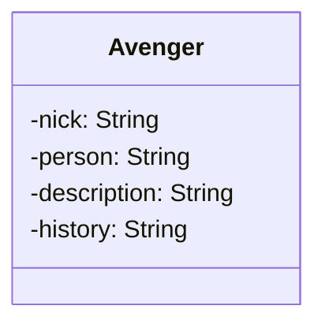

# Avengers API REST

# Sobre o projeto
Este projeto foi desenvolvido como parte do **Bootcamp Java AI Powered** promovido pela [DIO](https://web.dio.me) em colaboração com a [TONNIE](https://www.tonnietalent.com/).

A API, construída utilizando Kotlin e Spring Boot, proporciona aos usuários a capacidade de realizar operações essenciais para a gestão de super-heróis, incluindo criação, recuperação, atualização e exclusão.

# Diagrama de classes

# Tecnologias utilizadas
- Kotlin
- Spring Boot
- JPA/Hibernate
- Flyway Migration
- PostgreSQL
- Docker
- Maven

